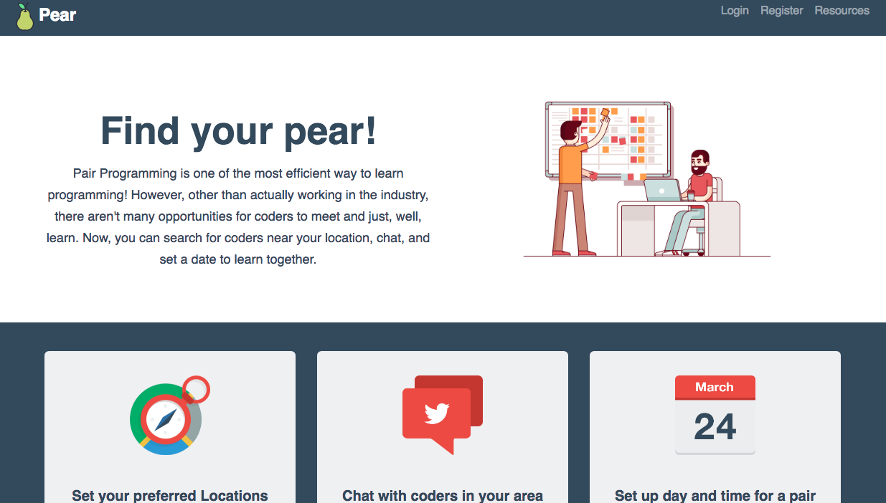

#   Pear Programming

## Live Version
http://glacial-earth-39942.herokuapp.com/

## Objectives
1. Users will be able to sign up using their Codewars's username
2. Users will have to specify their preferred general location (in SG), as well as the language that they would like to do their pair programming session on.
3. Users can refer to their dashboard to see other users that
..1. has the same Overall Kyu
.2. has the same preferred location
.3. has the same preferred langugage
4. At the Dashboard, users can choose to Chat with another user to set their pair programming date!

## Built with
.Node.js
.Express.js
.MongoDB
.Bootstrap (& FlatUI)
.Codewars API

### Acknowledgements to
.freepik - @iconicbestiary
