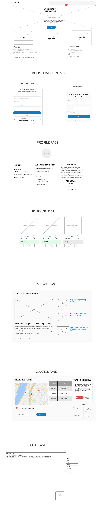

#   Pear Programming

## About
A website aimed at assisting Coders in Singapore to have a platform to learn about what pair programming is about as well as allowing them to find coders of similar level, and practicing pair programming together.

## Live Version
https://pear-programming.herokuapp.com/

## Objectives
1. Users can sign up using their Codewars's username
2. Users can specify their preferred general location (in SG), as well as the language that they would like to do their pair programming session on.
3. Users can refer to their dashboard to see their recommended pear that:
  * has the same Overall Kyu
  * has the same preferred location
  * has the same preferred langugage
4. At the Dashboard, users can choose to Chat with another user to set their pair programming date!

## Wire Frames

## ERD

## Potential Improvements

## Built with
* Node.js
* Express.js
* MongoDB
* Bootstrap (& FlatUI)
* Codewars API

### Acknowledgements to
* freepik - @iconicbestiary
